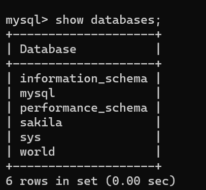
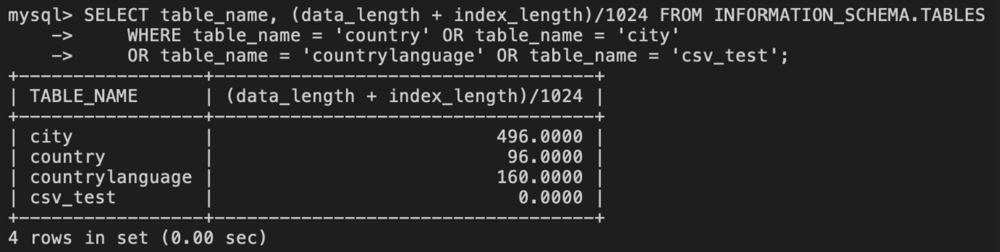
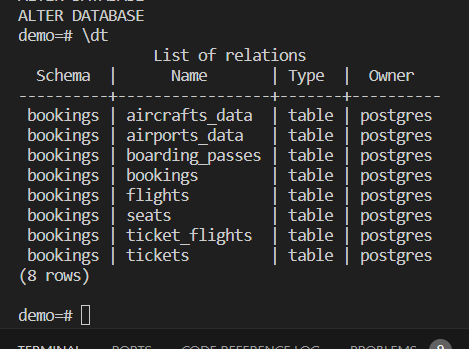
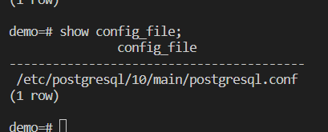
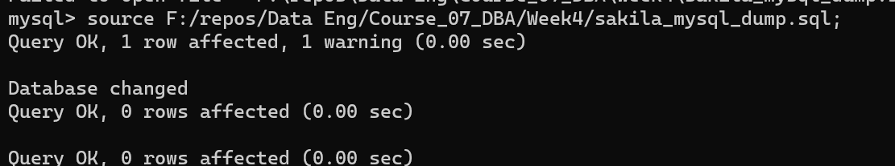

# Database management

## Database management life cycle

The database life cycle has 4 phases:

- Requirement analysis
- Design and plan
- Implementation
- Monitoring and maintaining:
  - monitor s ystem for performance issues,
  - review reports
  - apply upgrades and patches to RDBMS, 
  - automate deployments and routin tasks
  - troubleshoot issues 
  - Security and compliance: ensuring data is secure and only authorized users have access
    - review logs, monitor failed logins and data access activity
    - maintain database permission: grand/revoke access

 In the requirements analysis stage, DBAs determine the purpose and scope of the database by interviewing data users and producers, examining the data, and creating samples. 

 In the design and plan stage, DBAs work on logical and physical design. 

In the implementation stage, DBAs deploy the database.

And finally, in the monitor and maintain stage, DBAs manage the daily operations of the database.

### Data Security, Ethical and Compliance Considerations

- Secure system design: protection form malicious access, secure archiving, secure movement, secure storage, accurate access

- Compliance issues: National/international regulations, industry standards, organizations' best practice

A typical day of a database administrator includes checking the state of the database, answering to support tickets and resolving any issues, meeting with developers and other stakeholders and monitorind database activity.

#### MYsql default databases

There are multiple databases by default inside mysql server one of them is information_scheme

In the  `information_schema` database, there exists a table called `COLUMNS`` which contains meta data about the columns for all tables and views in the server. One of the columns in this table contains the names of all the other columns in every table.

Another point of interest in the `information_schema` database is the TABLES table which contains meta data about all the tables in the server. One of the columns in this table contains information about a table’s storage engine type.

Finally, the TABLES table in the `information_schema` database contains information on the the size of a given table in bytes. This information is stored in two columns: data_length and index_length which stores the size of the data in the table and the size of the index file for that table, respectively. Therefore, the total size of the table is the sum of the values in these two columns. This value would be given in bytes, however, if you wish to use a more convenient unit, the sum can be converted to kB by dividing by 1024. 

#### Database heirarchy

- An instance is a logical boundary for a database or set of databases where you organize database objects and set configuration parameters.
- A schema is a specialized database object that provides a way to group other database objects logically. Schemas also provide a naming context for database objects.
- Database objects are the items that exist within the database, such as tables, constraints, indexes, keys, views, aliases, triggers, events, and log files.

System objects store database metadata. You can query these objects to get information about the configuration and performance of your database. Different RDBMSes use different names for their system objects. Most use the terms system schema, system tables, catalog, or directory. Configuration files store the information that the database needs as it initializes.

**Tablespaces** are structures that contain database objects such as tables, indexes, large objects, and long data. DBAs use tablespaces to logically organize database objects based on where their data is stored. Tablespaces define the mapping between logical database objects and the physical storage containers that house the data for these objects. A storage container can be a data file, a directory, or a raw device. Tablespaces can contain one or more database objects.

You can use tablespaces to optimize performance. For example, you can place a heavily used index on a fast SSD. Alternatively, you can store tables containing rarely accessed or archived data on a less expensive but slower magnetic hard drive. Recoverability: Tablespaces make backup and restore operations more convenient. Using a single command, you can make a backup or restore all the database objects without worrying about which storage container each object or tablespace is stored on. Storage Management: The RDBMS creates and extends the datafiles or containers depending on the need. When necessary, you can also manually expand the storage space by adding another storage path or container to the tablespace. Some RDBMSes provide Storage group.

#### Postgres lab notes 

From the terminal first start the postgres service and then connect to it by the below commands 
`udo service postgresql start` and then
`sudo -u postgres psql`

Then in the postgresql cli enter the command `i <file_name.sql>` this will restore your data (in your sql file) into a new database called demo. Then you can check if the database has created successfully with the command  `\dt`

##### how to configure a postgresql server instance 

A postgresql server insance has a corrosponding file named `postgresql.conf` that contain the configuration parameters for the server. 

By modifying this file, you can enable, disable, or otherwise customize the settings of your PostgreSQL server instance to best suit your needs as a database administrator. While you can manually modify this postgresql.conf file and restart the server for the changes to take effect, you can also edit some configuration parameters directly from the command line interface (CLI).

`wal_level`
 parameter dictates how much information is written to the write-ahead log (WAL), which can be used for continuous archiving.

#### mysql backup 

A logical backup creates a file containing DDL (such as create table) and DML commands (such as insert) that recreate the objects and data in the database. As such,you can use this file to recreate the database on the same or on another system. Generally, when you perform a logical backup and restore, you reclaim any wastedspace from the original database since the restoration process creates a clean version of the tables. Logical backups enable you to backup granular objects. Forexample, you can back up an individual database table, however, you cannot use it to backup log files or database configuration settings

Backing up a table command:

`mysql --host=127.0.0.1 --port=3306 --user=root --password world countrylanguage > world_countrylanguage_mysql_backup.sql"`

and when it is for the full database command is like:

`mysql --host=127.0.0.1 --port=3306 --user=root --password --flush-logs --delete-master-logs --databases world > world_mysql_full_backup.sql`

NOTE:
The two parameters in the command above,
--flush-logs
(starts writing to a new binlog file) and
--delete-master-logs
(removes old binlogfiles) ensures that there will be only binary log files created after a full logical backup.

Restroe a full backup `mysql --host=127.0.0.1 --port=3306 --user=root --password < world_mysql_full_backup.sql`

#### Establishing a performance baseling

To determine whether your database system is performing at its most optimal, you first need to establish a baseline for your database system’s performance. To do this, you need to record key performance metrics at regular intervals over a given time period. Once you have established a database system performance baseline, you can then compare these baseline statistics with the performance of your database system at any given time. If your comparison indicates that the current performance measurements are either significantly above or below the performance baseline, then these can become potential targets for further analysis and investigation. From those investigations, you might then determine that some database elements need reconfiguring or optimizing. Even when things are working well, and as expected, you can still use your performance baseline data to help you determine operational norms, such as your peak and off-peak hours of operation, typical response times for running queries and processing batch commands, and the time taken to perform database backup and restore operations.
The following areas typically have the greatest effect on the performance of your database system:

- System hardware resources
- network architecture
- operating system
- database applications
 and client applications.

#### Troubleshooting common issues

The most common problems encountered with databases are caused by poor performance, improper configuration, or poor connectivity.

- Poor performance is typically caused by high latency for disk reads and writes, slow processing time by the server, or a poor connection between the client and server.
- Server configuration issues, such as inadequate hardware resources or misconfigured settings, can significantly impact performance. 
- Some of the most common connectivity problems are not being able to connect to the database server, the database server or instance not running properly, and client login credentials being incorrect. 
- And finally... Performance monitoring, reports, and server and database logs can help identify performance bottlenecks and determine the best way to correct them.

#### Troublshooting in postgres

Tip: to find the location of the conf file in your database you can use the command `SHOW config_file` and you will find the directory for the config file in the postgres database then you can navigate to the directory and edit config file with a text editor.

you can view server log with the command `SHOW log_directory;`

To inspect how long each query or command takes, enable the timer with the following command in the CLI:`\timing`

IF you get the error that you don't have the permissions to access the directory you need to switch to postgres user, This is likely because the PostgreSQL directories are owned by the postgres user for security reasons.

You can use sudo to become postgres user and then navigate to the directory

- `sudo -u postgres -i`
then try to navigate to the directory to access log files or config files in postgres 
`cd /var/lib/postgresql/10/main/log`  for log files & for config files `cd /etc/postgresql/10/main`. 

if you don't know the directory for config or log file you can ask directry from the postgres terminal `SHOW config_file`

##### mysql 

To use a sql file as a source of database in mysql use the source command followed by the sql file_path `source sql_file_path` here is an example how to pass the dirctory of the file in mysql cli
`source F:/repos/Data Eng/Course_07_DBA/Week4/sakila_mysql_dump.sql;`

#### Mysql backup process for automation

To automate the backup process we need to write a shell script that does the followings:

- Write the database into a sql file created with timestamp using `mysqldump` command. 
- zip the sql file into zipfile using `gzip` command 
- remove the sql file after zipping using `rm` command
- delete the backup after 30 days.
